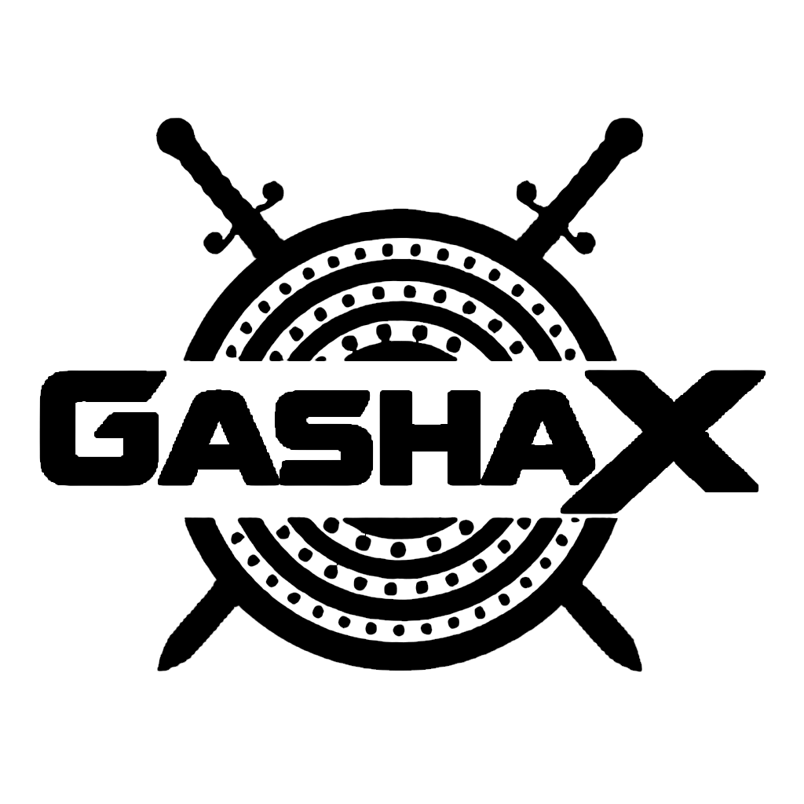

  

<h1 align="center">Paulos Berihun</h1>

  

  <strong>Bridging the gap between robust system architecture and national-grade cybersecurity.</strong> 
  Specializing in offensive security, red teaming, and the development of resilient, secure-by-design infrastructure.

  
  

---

## About Me

I am a secure software developer and cybersecurity engineer dedicated to building and protecting critical infrastructure. With a strong foundation in complex backend architecture and cloud environments, I engineer solutions that prioritize security from the first line of code. My work revolves around identifying vulnerabilities before they are exploited and designing systems capable of withstanding sophisticated threats.

### Current Focus
- **Offensive Security & Red Teaming:** Simulating advanced persistent threats to test and harden network perimeters.
- **Secure System Architecture:** Implementing Role-Based Access Control (RBAC) and building secure authentication pipelines using Python frameworks (Flask/FastAPI).
- **Cloud Security:** Designing isolated, encrypted environments for sensitive data operations and threat intelligence.

---

## Technical Arsenal

### Languages & Core

  

### Frameworks & Libraries

  

### Infrastructure, Cloud & Databases

  

  

### Cybersecurity Interests

  
  
  
  

---

## Featured Operations & Projects

| Project | Description | Role / Tech |
| :--- | :--- | :--- |
| **[GashaX Security](#)** | Co-founded an independent cybersecurity community focusing on threat research and secure systems development. | `Founder` `Infosec` |
| **[AegisTwin](#)** | Advanced security tool/platform designed for next-generation threat modeling and environment simulation. | `Security Engineering` |
| **[Tegen Cloud](#)** | Cloud-based architecture for securely storing highly sensitive information, built on robust TFGBV protection principles. | `Cloud Sec` `Backend` |
| **[EqubPro](#)** | Fintech platform modernizing traditional rotating savings associations through digital automation and algorithmic risk analysis. | `FastAPI` `Architecture` |
| **[Online Examination System](#)** | Comprehensive academic evaluation platform featuring secure exam conduction, anti-tampering, and real-time result processing. | `Full-Stack` `RBAC` |
| **[KUESSC Website](#)** | Official digital infrastructure for the Kotebe University of Education Science Shared Campus IT Club. | `Web Dev` `Leadership` |

---

## Achievements & Milestones

> **picoCTF 2026:** Led GashaX Security to rank **101st in Africa**, demonstrating high proficiency in cryptography, web exploitation, reverse engineering, and forensics against a global talent pool.

---

## GitHub Analytics

    
  

 

  

---

## Philosophy

> *"Talk is cheap. Show me the code. The world doesn’t run on ideas alone; it runs on people who make those ideas work — line by line, bug by bug, solution by solution."*

  

